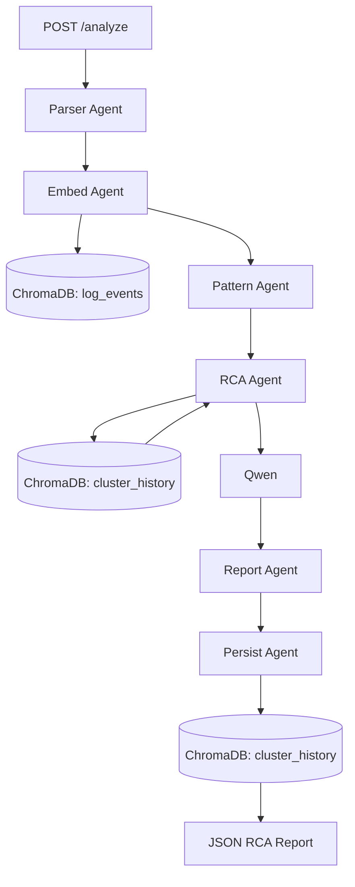

# LogMind

AI-powered Root Cause Analysis (RCA) system built with LangGraph, ChromaDB, FastAPI and Qwen.

LogMind helps engineers investigate incidents faster by combining agentic workflows, semantic retrieval and Large Language Models to automatically identify patterns, retrieve similar incidents and generate structured investigation reports.

> ⚠️ This project is a proof of concept designed to explore modern AI Engineering concepts such as multi-agent systems, RAG pipelines and automated Root Cause Analysis.

---

## Overview

Investigating production incidents often requires manually reviewing thousands of log lines and correlating information across multiple services.

LogMind automates part of this process through a multi-agent workflow capable of:

- Parsing and structuring raw logs
- Detecting recurring error patterns
- Retrieving similar historical incidents
- Generating root cause hypotheses
- Producing actionable investigation reports
- Building incident memory for future analyses

---

## Architecture



---

## How It Works

### 1. Parser Agent

The parser transforms raw log entries into structured events.

Example:

```text
2026-06-01 12:05:12 ERROR auth-service Database connection timeout
```

becomes:

```json
{
  "timestamp": "2026-06-01T12:05:12",
  "level": "ERROR",
  "service": "auth-service",
  "message": "Database connection timeout"
}
```

This normalization ensures all downstream agents work with consistent data.

---

### 2. Embedding Agent

Each log event is converted into a vector representation.

These embeddings allow semantic comparisons between incidents and support retrieval operations within ChromaDB.

---

### 3. Pattern Agent

The Pattern Agent identifies recurring error signatures and clusters similar events together.

Its objective is to:

- Reduce noise
- Highlight anomalous behaviors
- Detect recurring failure patterns

This helps focus the investigation on the most relevant signals.

---

### 4. RCA Agent

The RCA Agent performs Retrieval-Augmented Root Cause Analysis.

For each detected cluster:

1. A representative embedding (cluster centroid) is computed.
2. Similar historical clusters are retrieved from ChromaDB.
3. Historical context is combined with current log evidence.
4. Qwen generates root cause hypotheses and remediation recommendations.

This allows LogMind to leverage past incidents when investigating new failures.

---

### 5. Report Agent

Once the analysis is complete, the Report Agent generates a structured investigation report containing:

- Incident summary
- Root cause hypotheses
- Supporting evidence
- Impact assessment
- Recommended remediation actions

---

### 6. Persist Agent

The Persist Agent stores incident knowledge in ChromaDB.

Future investigations can leverage this memory through Retrieval-Augmented Generation (RAG), allowing LogMind to continuously improve contextual understanding over time.

---

## Tech Stack

| Category | Technologies |
|-----------|-------------|
| Backend | FastAPI |
| Agent Framework | LangGraph |
| LLM | Qwen |
| Vector Database | ChromaDB |
| Embeddings | SentenceTransformers |
| Data Processing | Pandas |
| Logging | Structlog |
| Containerization | Docker |
| Testing | Pytest |
| Observability | LangSmith |

## Installation

### Prerequisites

- Docker Desktop
- Git

### Clone the repository

```bash
git clone https://github.com/TheoBrln4/logmind.git
cd logmind
```

### Start the containers

```bash
docker compose up --build -d
```

### Download the LLM

```bash
docker compose exec ollama ollama pull qwen2.5:1.5b
```

The model only needs to be downloaded once.

### Verify the services

```bash
docker compose ps
```

All containers should be running before using LogMind.

## Observability with LangSmith

LogMind is instrumented with LangSmith to observe and debug the AI workflow.

LangSmith is used to inspect:

- Agent execution traces
- LLM inputs and outputs
- Intermediate workflow steps
- Runtime errors
- RCA generation behavior

This makes it easier to understand how the system moves from raw logs to a generated root cause analysis report.

### Environment variables

Create a `.env` file at the root of the project:

```env
LANGSMITH_TRACING=true
LANGSMITH_API_KEY=your_langsmith_api_key
LANGSMITH_PROJECT=logmind

## Usage

### Launch Docker Desktop

Make sure Docker Desktop is running.

### Start LogMind

From the project directory:

```bash
docker compose up -d
```

### Open the API Documentation

Navigate to:

```text
http://localhost:8000/docs
```

Swagger UI provides an interactive interface to test all available endpoints.

---

### Populate the Incident Database

Before running Root Cause Analysis, you can populate the ChromaDB knowledge base with synthetic incidents.

Use the incident generation endpoint:

```http
POST /generate-incidents
```

This endpoint generates sample incidents and stores them in ChromaDB.

These incidents are later used by the RCA Agent through Retrieval-Augmented Generation (RAG) to retrieve similar historical failures.

---

### Analyze Logs

Use the analysis endpoint:

```http
POST /analyze
```

1. Click **Try it out**.
2. Paste your logs into the request body.
3. Execute the request.
4. Review the generated Root Cause Analysis report.

The response includes:

- Detected patterns
- Similar historical incidents
- Root cause hypotheses
- Recommended remediation actions

---

### Typical Workflow

1. Start LogMind.
2. Generate historical incidents using `/generate-incidents`.
3. Verify incidents are stored in ChromaDB.
4. Submit logs to `/analyze`.
5. Review the generated RCA report.

## Example Workflow

### Input

```text
2026-06-05 16:38:49 WARNING  spark-executor-4 High memory pressure detected — heap used 1800 MB / 2048 MB, GC overhead rising

2026-06-05 16:38:55 WARNING  spark-executor-3 High memory pressure detected — heap used 2020 MB / 2048 MB, GC overhead rising

2026-06-05 16:38:56 ERROR    spark-executor-1 GC overhead limit exceeded on partition 42

2026-06-05 16:38:58 CRITICAL spark-executor-4 OutOfMemoryError: Java heap space — executor killed
```

### Output

```text
Root Cause Analysis

Root Cause:
Excessive memory consumption in Spark executors leading to sustained garbage collection activity and ultimately an OutOfMemoryError.

Evidence:
- 12 high-memory-pressure events detected.
- Heap usage increased from 1800 MB to 2020 MB out of 2048 MB.
- Multiple "GC overhead limit exceeded" errors observed.
- Executor termination caused by "OutOfMemoryError: Java heap space".

Impact:
- Spark executor failure.
- Potential interruption of data processing jobs.
- Increased execution latency due to garbage collection overhead.

Recommended Actions:
- Increase executor memory allocation.
- Review partition sizing and data skew.
- Optimize memory-intensive transformations.
- Monitor GC metrics and executor memory usage.
```

### Detected Clusters

| Cluster | Events | Representative Pattern |
|----------|----------|------------------------|
| 0 | 1 | OutOfMemoryError: Java heap space |
| 1 | 12 | High memory pressure detected |
| 2 | 7 | GC overhead limit exceeded |

This example illustrates how LogMind combines log parsing, pattern detection, semantic retrieval and LLM reasoning to identify the most likely root cause and generate actionable recommendations.

## AI Engineering Concepts Demonstrated

This project explores several modern AI Engineering techniques:

- Multi-Agent Systems
- LangGraph Workflows
- Retrieval-Augmented Generation (RAG)
- Semantic Search
- Vector Databases
- Root Cause Analysis Automation
- LLM-Powered Reasoning
- Incident Knowledge Management
- Production APIs with FastAPI
- LLM Observability with LangSmith
- RAG Evaluation Awareness with RAGAS

## Evaluation Note

RAGAS was considered as an evaluation framework for measuring RAG quality through metrics such as faithfulness, context precision and context recall.

For this proof of concept, RAGAS was not integrated directly into the runtime pipeline because LogMind prioritizes local execution with Ollama and Qwen. The project instead focuses on workflow observability with LangSmith, while keeping RAGAS as a possible offline evaluation extension.

---
